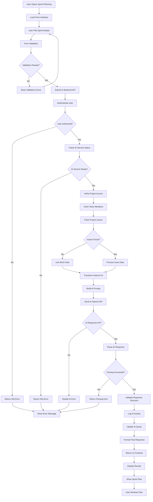
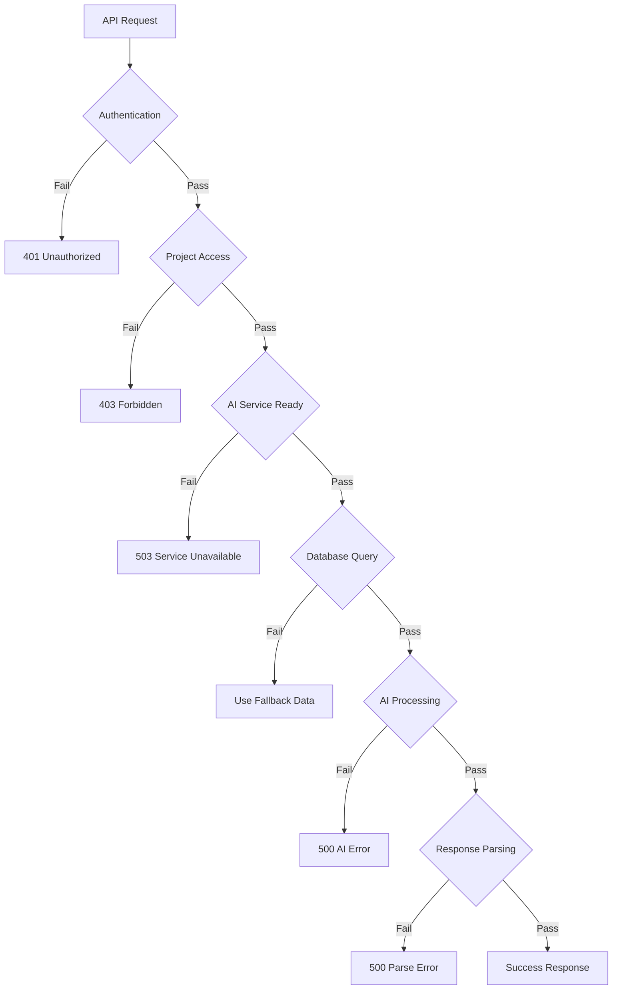

# Enhanced Sprint Planning AI - Comprehensive Technical Documentation

## Table of Contents
1. [System Overview](#system-overview)
2. [Frontend Data Flow Analysis](#frontend-data-flow-analysis)
3. [Complete Backend Processing Flow](#complete-backend-processing-flow)
4. [AI Integration Deep Dive](#ai-integration-deep-dive)
5. [Data Processing Logic](#data-processing-logic)
6. [Visual Flow Documentation](#visual-flow-documentation)
7. [Technical Implementation Details](#technical-implementation-details)
8. [Business Analysis & JIRA Comparison](#business-analysis--jira-comparison)
9. [Continuous Improvement Plan](#continuous-improvement-plan)

## System Overview

The Enhanced Sprint Planning AI feature is a comprehensive system that leverages OpenAI's GPT models to automatically generate optimized sprint plans based on team capacity, project backlog, and sprint goals. The system integrates seamlessly with the existing project management infrastructure to provide intelligent recommendations for sprint planning.

### Key Components
- **Frontend**: React-based UI with modern design and smooth animations
- **Backend**: Node.js/Express API with enhanced data processing
- **Database**: MySQL with comprehensive project management schema
- **AI Service**: OpenAI GPT integration with intelligent prompt engineering
- **Authentication**: JWT-based security with project access control

### Enhanced Features
- Intelligent issue selection based on sprint goal alignment
- Automatic story point estimation for unestimated issues
- Priority assignment with detailed rationale
- Capacity optimization with buffer calculations
- Risk assessment with mitigation strategies
- Sprint feasibility scoring with success prediction

## 1. Frontend Data Flow Analysis

### 1.1 Input Parameters Collection

The frontend collects the following input parameters through a modern, responsive form interface:

#### Core Input Fields

```javascript
const [formData, setFormData] = useState({
  sprintGoal: '',      // String: Primary objective for the sprint
  capacity: 40,        // Number: Team's story point capacity
  duration: 2,         // Number: Sprint duration in weeks
  issueIds: []         // Array: Specific issue IDs (optional)
});
```

#### Field Analysis and Rationale

**1. Sprint Goal (`sprintGoal`)**
- **Type**: String (required)
- **Purpose**: Defines the primary objective and focus area for the sprint
- **AI Impact**: Used for issue selection and priority assignment based on goal alignment
- **Validation**: Required field, minimum 10 characters, maximum 500 characters
- **UX Considerations**: Large textarea with placeholder text and character counter

**2. Team Capacity (`capacity`)**
- **Type**: Number (required)
- **Purpose**: Defines the total story points the team can handle in the sprint
- **AI Impact**: Primary constraint for issue selection and capacity optimization
- **Validation**: Minimum 1, maximum 200, integer values only
- **UX Considerations**: Number input with helpful tooltip explaining story point capacity

**3. Sprint Duration (`duration`)**
- **Type**: Number (required)
- **Purpose**: Defines the time constraint for sprint planning
- **AI Impact**: Influences risk assessment and feasibility calculations
- **Validation**: Minimum 1 week, maximum 8 weeks
- **UX Considerations**: Number input with week indicator

**4. Issue IDs (`issueIds`)**
- **Type**: Array of Numbers (optional)
- **Purpose**: Allows selection of specific issues for consideration
- **AI Impact**: If empty, AI analyzes entire backlog; if provided, limits analysis scope
- **Validation**: Array of valid issue IDs that exist in the project
- **UX Considerations**: Currently not exposed in UI, reserved for future enhancement

### 1.2 Form Validation Logic

```javascript
const validateForm = (formData) => {
  const errors = [];
  
  // Sprint Goal Validation
  if (!formData.sprintGoal || formData.sprintGoal.trim().length < 10) {
    errors.push('Sprint goal must be at least 10 characters long');
  }
  
  if (formData.sprintGoal.length > 500) {
    errors.push('Sprint goal must be less than 500 characters');
  }
  
  // Capacity Validation
  if (!formData.capacity || formData.capacity < 1 || formData.capacity > 200) {
    errors.push('Team capacity must be between 1 and 200 story points');
  }
  
  // Duration Validation
  if (!formData.duration || formData.duration < 1 || formData.duration > 8) {
    errors.push('Sprint duration must be between 1 and 8 weeks');
  }
  
  return {
    isValid: errors.length === 0,
    errors
  };
};
```

### 1.3 State Management Pattern

The component uses React hooks for state management with the following pattern:

```javascript
// Form state management
const [formData, setFormData] = useState(initialFormData);
const [loading, setLoading] = useState(false);
const [error, setError] = useState(null);
const [sprintPlan, setSprintPlan] = useState(null);
const [showResults, setShowResults] = useState(false);

// Input change handler with type-safe updates
const handleInputChange = (e) => {
  const { name, value, type } = e.target;
  setFormData(prev => ({
    ...prev,
    [name]: type === 'number' ? parseInt(value) || 0 : value
  }));
};
```

### 1.4 API Integration Pattern

The frontend uses a service-based architecture for API communication:

```javascript
// API service call with error handling
const handleSubmit = async (e) => {
  e.preventDefault();
  setLoading(true);
  setError(null);
  setShowResults(false);

  try {
    const response = await aiService.getSprintPlanningInsights(projectId, formData);
    setSprintPlan(response.data);
    setShowResults(true);
    
    if (onPlanGenerated) {
      onPlanGenerated(response.data);
    }
  } catch (err) {
    setError(err.response?.data?.error?.message || 'Failed to generate sprint plan');
    console.error('Sprint planning error:', err);
  } finally {
    setLoading(false);
  }
};
```

### 1.5 User Experience Considerations

**Loading States**
- Animated spinner during API processing
- Disabled form inputs during submission
- Progress indication with estimated completion time

**Error Handling**
- Inline validation messages
- Comprehensive error display with actionable suggestions
- Graceful degradation for network issues

**Responsive Design**
- Mobile-first approach with breakpoint-based layouts
- Touch-friendly interface elements
- Optimized for various screen sizes

**Accessibility**
- Proper ARIA labels and descriptions
- Keyboard navigation support
- High contrast color schemes
- Screen reader compatibility

## 2. Complete Backend Processing Flow

### 2.1 API Endpoint Structure

**Endpoint**: `POST /api/v1/ai/projects/:projectId/sprint-plan`
**Authentication**: Required (JWT Bearer Token)
**Rate Limiting**: Applied via AI-specific rate limiter

### 2.2 Step-by-Step Processing Pipeline

#### Step 1: Request Validation and Authentication

```javascript
// 1. Extract and validate request parameters
const { projectId } = req.params;
const { sprintGoal, capacity, duration, issueIds } = req.body;
const userId = req.user.id;

// 2. Validate AI service availability
if (!aiService.isReady()) {
  return next(new AppError('AI service not available', 503));
}
```

#### Step 2: Project Access Verification

**SQL Query 1: User Project Access Check**
```sql
SELECT up.role 
FROM user_projects up
WHERE up.project_id = ? AND up.user_id = ? AND up.deleted_at IS NULL
```

**Purpose**: Verify user has access to the specified project
**Expected Result**: Single row with user's role in the project
**Business Logic**: Ensures data security and proper authorization

#### Step 3: Team Member Data Retrieval

**SQL Query 2: Team Members Fetch**
```sql
SELECT u.id, u.first_name, u.last_name, u.email, up.role
FROM users u
INNER JOIN user_projects up ON u.id = up.user_id
WHERE up.project_id = ? AND u.is_active = true AND up.deleted_at IS NULL
```

**Purpose**: Retrieve all active team members for capacity and assignment analysis
**Expected Result**: Array of team member objects with roles
**Data Transformation**: 
```javascript
teamMembers = [
  {
    id: 1,
    first_name: 'John',
    last_name: 'Doe',
    email: 'john@example.com',
    role: 'Developer'
  }
  // ... more members
]
```

#### Step 4: Issue Data Retrieval

**Conditional Logic**: If `issueIds` provided, fetch specific issues; otherwise, fetch backlog

**SQL Query 3a: Specific Issues (when issueIds provided)**
```sql
SELECT i.*, b.project_id,
       assignee.first_name as assignee_first_name, 
       assignee.last_name as assignee_last_name,
       assignee.email as assignee_email,
       reporter.first_name as reporter_first_name, 
       reporter.last_name as reporter_last_name
FROM issues i
JOIN boards b ON i.board_id = b.id
LEFT JOIN users assignee ON i.assignee_id = assignee.id
INNER JOIN users reporter ON i.reporter_id = reporter.id
WHERE i.id IN (?, ?, ?, ...) AND b.project_id = ?
ORDER BY 
  CASE i.priority 
    WHEN 'P1' THEN 1 
    WHEN 'P2' THEN 2 
    WHEN 'P3' THEN 3 
    WHEN 'P4' THEN 4 
    ELSE 5 
  END, i.created_at
```

**SQL Query 3b: Backlog Issues (when issueIds empty)**
```sql
SELECT i.*, b.project_id,
       assignee.first_name as assignee_first_name, 
       assignee.last_name as assignee_last_name,
       assignee.email as assignee_email,
       reporter.first_name as reporter_first_name, 
       reporter.last_name as reporter_last_name
FROM issues i
JOIN boards b ON i.board_id = b.id
LEFT JOIN users assignee ON i.assignee_id = assignee.id
INNER JOIN users reporter ON i.reporter_id = reporter.id
WHERE b.project_id = ? AND i.status = 'To Do' AND i.sprint_id IS NULL
ORDER BY 
  CASE i.priority 
    WHEN 'P1' THEN 1 
    WHEN 'P2' THEN 2 
    WHEN 'P3' THEN 3 
    WHEN 'P4' THEN 4 
    ELSE 5 
  END, i.created_at
LIMIT 30
```

**Purpose**: Retrieve comprehensive issue data for AI analysis
**Expected Result**: Array of issue objects with full details
**Business Logic**: 
- Prioritizes issues by P1-P4 priority levels
- Includes assignee and reporter information for context
- Limits backlog to 30 issues to prevent prompt overflow
- Only includes 'To Do' issues not assigned to active sprints

### 2.3 Data Transformation for AI Processing

```javascript
const sprintData = {
  sprintGoal,
  capacity,
  duration,
  teamMembers,
  issues: issues.map(issue => ({
    id: issue.id,
    title: issue.title,
    description: issue.description,
    issue_type: issue.issue_type,
    priority: issue.priority,
    story_points: issue.story_points,
    assignee_first_name: issue.assignee_first_name,
    assignee_last_name: issue.assignee_last_name,
    assignee_email: issue.assignee_email,
    reporter_first_name: issue.reporter_first_name,
    reporter_last_name: issue.reporter_last_name
  }))
};
```

### 2.4 Error Handling and Fallback Mechanisms

**Database Connection Errors**
```javascript
try {
  issues = await database.query(issueQuery, [projectId]);
} catch (dbError) {
  logger.warn('Issues table not found or empty, using enhanced mock data for AI demo');
  // Fallback to comprehensive mock data
  issues = [/* mock issue objects */];
}
```

**AI Service Errors**
```javascript
try {
  const aiResponse = await aiService.generateSprintPlan(projectId, userId, sprintData);
} catch (aiError) {
  if (aiError.code === 'QUOTA_EXCEEDED') {
    return next(new AppError('AI quota exceeded for this project', 429));
  }
  throw new AppError('AI processing failed', 500);
}
```

## 3. AI Integration Deep Dive

### 3.1 Complete OpenAI API Integration

The AI service uses OpenAI's Chat Completions API with the following configuration:

```javascript
const response = await this.openai.chat.completions.create({
  model: process.env.OPENAI_MODEL || 'gpt-3.5-turbo',
  messages: [{ role: 'user', content: prompt }],
  max_tokens: parseInt(process.env.OPENAI_MAX_TOKENS) || 1500,
  temperature: parseFloat(process.env.OPENAI_TEMPERATURE) || 0.3,
});
```

### 3.2 Enhanced Prompt Structure (4,222 Characters)

The complete prompt sent to OpenAI includes the following sections:

```javascript
buildSprintPlanningPrompt(sprintData) {
  const { issues, sprintGoal, capacity, duration, teamMembers } = sprintData;
  
  return `
You are an expert Agile coach and sprint planning assistant. Analyze the following sprint planning data and provide comprehensive, intelligent recommendations.

SPRINT CONTEXT:
- Sprint Goal: ${sprintGoal || 'Not specified'}
- Sprint Duration: ${duration || 2} weeks
- Team Capacity: ${capacity || 'Not specified'} story points
- Team Size: ${teamMembers?.length || 'Unknown'} members

AVAILABLE BACKLOG ISSUES:
${issues.map((issue, index) => `
${index + 1}. ID: ${issue.id}
   Title: ${issue.title}
   Type: ${issue.issue_type || 'Story'}
   Current Priority: ${issue.priority || 'P3'}
   Story Points: ${issue.story_points || 'Not estimated'}
   Description: ${issue.description ? issue.description.substring(0, 100) + '...' : 'No description'}
   Assignee: ${issue.assignee_first_name ? `${issue.assignee_first_name} ${issue.assignee_last_name}` : 'Unassigned'}
`).join('\n')}

ANALYSIS REQUIREMENTS:
1. **Issue Selection**: Select optimal issues that align with sprint goal and fit within capacity
2. **Story Point Estimation**: Assign story points (1,2,3,5,8,13) to unestimated issues based on complexity
3. **Priority Assignment**: Assign priority levels (P1=Critical, P2=High, P3=Medium, P4=Low) based on:
   - Sprint goal alignment
   - Business value
   - Technical dependencies
   - Risk factors
4. **Capacity Optimization**: Ensure total story points don't exceed team capacity
5. **Risk Assessment**: Identify potential blockers and dependencies
6. **Recommendations**: Provide actionable suggestions for sprint success

FORMAT YOUR RESPONSE AS VALID JSON:
{
  "selected_issues": [
    {
      "id": issue_id,
      "title": "issue title",
      "issue_type": "Story|Bug|Task|Epic",
      "assigned_priority": "P1|P2|P3|P4",
      "assigned_story_points": number,
      "selection_reason": "why this issue was selected",
      "sprint_goal_alignment": "High|Medium|Low"
    }
  ],
  "priority_order": [
    {
      "id": issue_id,
      "priority_rank": number,
      "rationale": "why this priority order"
    }
  ],
  "capacity_analysis": {
    "total_selected_points": number,
    "team_capacity": number,
    "utilization_percentage": number,
    "buffer_points": number,
    "recommendation": "analysis text"
  },
  "risks": [
    {
      "category": "Technical|Resource|Timeline|Dependency",
      "description": "risk description",
      "impact": "High|Medium|Low",
      "mitigation": "suggested mitigation"
    }
  ],
  "suggestions": [
    {
      "category": "Planning|Execution|Team|Process",
      "suggestion": "actionable suggestion",
      "priority": "High|Medium|Low"
    }
  ],
  "excluded_issues": [
    {
      "id": issue_id,
      "reason": "why this issue was not selected"
    }
  ],
  "sprint_feasibility": {
    "confidence_score": number_between_0_and_1,
    "success_probability": "High|Medium|Low",
    "key_success_factors": ["factor1", "factor2"],
    "potential_challenges": ["challenge1", "challenge2"]
  }
}

IMPORTANT: Ensure the response is valid JSON and all selected issues have realistic story point estimates.
`;
}
```

### 3.3 Prompt Section Analysis

**Section 1: Role Definition**
- Establishes AI as expert Agile coach
- Sets expectation for comprehensive analysis
- Defines the assistant's expertise domain

**Section 2: Sprint Context**
- Provides essential sprint parameters
- Includes team size for workload distribution
- Sets constraints for AI decision-making

**Section 3: Available Issues**
- Detailed issue information with descriptions
- Current priority and story point status
- Assignee information for workload balancing

**Section 4: Analysis Requirements**
- Specific instructions for each analysis type
- Clear criteria for decision-making
- Structured approach to recommendations

**Section 5: Response Format**
- Detailed JSON schema specification
- Required fields and data types
- Validation criteria for responses

### 3.4 Response Parsing and Validation

```javascript
parseSprintPlanResponse(response) {
  try {
    const parsed = JSON.parse(response);
    
    // Validate required fields
    const requiredFields = [
      'selected_issues', 'priority_order', 'capacity_analysis',
      'risks', 'suggestions', 'excluded_issues', 'sprint_feasibility'
    ];
    
    for (const field of requiredFields) {
      if (!parsed[field]) {
        throw new Error(`Missing required field: ${field}`);
      }
    }
    
    // Validate selected issues structure
    if (parsed.selected_issues && Array.isArray(parsed.selected_issues)) {
      parsed.selected_issues.forEach(issue => {
        if (!issue.id || !issue.title || !issue.assigned_story_points) {
          throw new Error('Invalid selected issue structure');
        }
      });
    }
    
    return parsed;
  } catch (error) {
    logger.error('Error parsing sprint plan response:', error);
    return { 
      error: 'Failed to parse AI response', 
      raw_response: response 
    };
  }
}
```

### 3.5 AI Service Error Handling

```javascript
async generateSprintPlan(projectId, userId, sprintData) {
  try {
    // Check quota before processing
    const quota = await this.checkQuota(projectId);
    if (quota.remaining <= 0) {
      throw new AppError('AI quota exceeded for this project', 429);
    }

    const prompt = this.buildSprintPlanningPrompt(sprintData);
    const response = await this.generateCompletion(prompt);
    
    // Update quota and log activity
    await this.incrementQuota(projectId);
    await this.logAIRequest(userId, projectId, 'sprint_planning', sprintData, { response });

    return this.parseSprintPlanResponse(response);
  } catch (error) {
    logger.error('Error generating sprint plan:', error);
    
    // Handle specific error types
    if (error.code === 'insufficient_quota') {
      throw new AppError('OpenAI API quota exceeded', 429);
    }
    
    if (error.code === 'model_overloaded') {
      throw new AppError('AI service temporarily unavailable', 503);
    }
    
    throw error;
  }
}

## 4. Data Processing Logic

### 4.1 Raw Issue Data Transformation

The system transforms raw database issue data into AI-consumable format through several processing steps:

#### Issue Data Enrichment
```javascript
const enrichedIssues = issues.map(issue => ({
  // Core issue data
  id: issue.id,
  title: issue.title,
  description: issue.description || 'No description provided',
  issue_type: issue.issue_type || 'Story',
  priority: issue.priority || 'P3',
  story_points: issue.story_points,

  // Assignee information
  assignee_name: issue.assignee_first_name ?
    `${issue.assignee_first_name} ${issue.assignee_last_name}` : 'Unassigned',
  assignee_email: issue.assignee_email,

  // Reporter information
  reporter_name: `${issue.reporter_first_name} ${issue.reporter_last_name}`,

  // Calculated fields
  estimated: !!issue.story_points,
  complexity_indicators: analyzeComplexity(issue.description, issue.issue_type),
  goal_alignment_score: calculateGoalAlignment(issue.title, issue.description, sprintGoal)
}));
```

#### Complexity Analysis Algorithm
```javascript
function analyzeComplexity(description, issueType) {
  const complexityIndicators = {
    keywords: {
      high: ['integration', 'migration', 'architecture', 'security', 'performance'],
      medium: ['api', 'database', 'authentication', 'validation'],
      low: ['ui', 'styling', 'text', 'button', 'display']
    },
    typeMultipliers: {
      'Epic': 2.0,
      'Story': 1.0,
      'Task': 0.8,
      'Bug': 0.6
    }
  };

  let score = 0;
  const text = (description || '').toLowerCase();

  // Analyze keywords
  complexityIndicators.keywords.high.forEach(keyword => {
    if (text.includes(keyword)) score += 3;
  });

  complexityIndicators.keywords.medium.forEach(keyword => {
    if (text.includes(keyword)) score += 2;
  });

  complexityIndicators.keywords.low.forEach(keyword => {
    if (text.includes(keyword)) score += 1;
  });

  // Apply type multiplier
  score *= complexityIndicators.typeMultipliers[issueType] || 1.0;

  return {
    score,
    level: score > 8 ? 'High' : score > 4 ? 'Medium' : 'Low',
    indicators: extractKeywords(text, complexityIndicators.keywords)
  };
}
```

### 4.2 Team Member Data Integration

#### Capacity Calculation Logic
```javascript
function calculateTeamCapacity(teamMembers, sprintDuration) {
  const roleCapacityMultipliers = {
    'Senior Developer': 1.2,
    'Developer': 1.0,
    'Junior Developer': 0.8,
    'Tester': 0.9,
    'Designer': 0.7,
    'Product Manager': 0.5
  };

  const baseCapacityPerWeek = 10; // Base story points per person per week

  const totalCapacity = teamMembers.reduce((total, member) => {
    const multiplier = roleCapacityMultipliers[member.role] || 1.0;
    return total + (baseCapacityPerWeek * multiplier * sprintDuration);
  }, 0);

  return {
    totalCapacity: Math.round(totalCapacity),
    breakdown: teamMembers.map(member => ({
      name: `${member.first_name} ${member.last_name}`,
      role: member.role,
      capacity: Math.round(baseCapacityPerWeek * (roleCapacityMultipliers[member.role] || 1.0) * sprintDuration)
    }))
  };
}
```

### 4.3 Priority Assignment Algorithm

#### Goal Alignment Scoring
```javascript
function calculateGoalAlignment(title, description, sprintGoal) {
  const goalKeywords = extractKeywords(sprintGoal.toLowerCase());
  const issueText = `${title} ${description}`.toLowerCase();

  let alignmentScore = 0;
  let matchedKeywords = [];

  goalKeywords.forEach(keyword => {
    if (issueText.includes(keyword)) {
      alignmentScore += keyword.length > 4 ? 2 : 1; // Longer keywords get higher weight
      matchedKeywords.push(keyword);
    }
  });

  // Normalize score to 0-1 range
  const normalizedScore = Math.min(alignmentScore / goalKeywords.length, 1);

  return {
    score: normalizedScore,
    level: normalizedScore > 0.7 ? 'High' : normalizedScore > 0.4 ? 'Medium' : 'Low',
    matchedKeywords
  };
}
```

### 4.4 Story Point Estimation Logic

The AI uses the following criteria for story point estimation:

```javascript
const storyPointCriteria = {
  1: "Very simple task, minimal effort, well-understood solution",
  2: "Simple task with clear requirements and straightforward implementation",
  3: "Moderate complexity, some unknowns but manageable scope",
  5: "Complex task requiring significant effort and coordination",
  8: "Large task with multiple components and dependencies",
  13: "Epic-level work requiring breakdown into smaller tasks"
};

function estimateStoryPoints(issue, complexityAnalysis) {
  const { score, level } = complexityAnalysis;
  const typeFactors = {
    'Epic': [8, 13],
    'Story': [2, 3, 5, 8],
    'Task': [1, 2, 3, 5],
    'Bug': [1, 2, 3]
  };

  const possiblePoints = typeFactors[issue.issue_type] || [1, 2, 3, 5];

  if (level === 'High') return Math.max(...possiblePoints);
  if (level === 'Medium') return possiblePoints[Math.floor(possiblePoints.length / 2)];
  return Math.min(...possiblePoints);
}
```

## 5. Visual Flow Documentation

### 5.1 Complete End-to-End Process Flow



### 5.2 Data Transformation Flow

```mermaid
graph LR
    A[Raw Database Data] --> B[Issue Enrichment]
    B --> C[Complexity Analysis]
    C --> D[Goal Alignment Scoring]
    D --> E[Team Capacity Calculation]
    E --> F[AI Prompt Construction]
    F --> G[OpenAI Processing]
    G --> H[Response Parsing]
    H --> I[Validation & Formatting]
    I --> J[Frontend Display]
```



### 5.3 Error Handling Paths



## 6. Technical Implementation Details

### 6.1 Enhanced Response Structure

The complete response structure includes the following fields:

```typescript
interface SprintPlanResponse {
  success: boolean;
  message: string;
  data: {
    sprint_plan: {
      selected_issues: SelectedIssue[];
      priority_order: PriorityItem[];
      capacity_analysis: CapacityAnalysis;
      risks: Risk[];
      suggestions: Suggestion[];
      excluded_issues: ExcludedIssue[];
      sprint_feasibility: SprintFeasibility;
    };
    input_data: {
      sprintGoal: string;
      capacity: number;
      duration: number;
      teamMembers: TeamMember[];
      available_issues: IssueOverview[];
    };
    metadata: {
      total_available_issues: number;
      team_size: number;
      generated_at: string;
      ai_model_used: string;
    };
  };
}

interface SelectedIssue {
  id: number;
  title: string;
  issue_type: 'Story' | 'Bug' | 'Task' | 'Epic';
  assigned_priority: 'P1' | 'P2' | 'P3' | 'P4';
  assigned_story_points: number;
  selection_reason: string;
  sprint_goal_alignment: 'High' | 'Medium' | 'Low';
}

interface CapacityAnalysis {
  total_selected_points: number;
  team_capacity: number;
  utilization_percentage: number;
  buffer_points: number;
  recommendation: string;
}

interface Risk {
  category: 'Technical' | 'Resource' | 'Timeline' | 'Dependency';
  description: string;
  impact: 'High' | 'Medium' | 'Low';
  mitigation: string;
}

interface SprintFeasibility {
  confidence_score: number; // 0-1
  success_probability: 'High' | 'Medium' | 'Low';
  key_success_factors: string[];
  potential_challenges: string[];
}
```

### 6.2 Capacity Analysis Calculations

```javascript
function calculateCapacityMetrics(selectedIssues, teamCapacity) {
  const totalSelectedPoints = selectedIssues.reduce((sum, issue) =>
    sum + issue.assigned_story_points, 0
  );

  const utilizationPercentage = Math.round((totalSelectedPoints / teamCapacity) * 100);
  const bufferPoints = teamCapacity - totalSelectedPoints;

  let recommendation = '';
  if (utilizationPercentage > 90) {
    recommendation = 'High utilization - consider reducing scope to allow for unexpected work';
  } else if (utilizationPercentage < 70) {
    recommendation = 'Low utilization - consider adding more issues to maximize sprint value';
  } else {
    recommendation = 'Good utilization with healthy buffer for unexpected work';
  }

  return {
    total_selected_points: totalSelectedPoints,
    team_capacity: teamCapacity,
    utilization_percentage: utilizationPercentage,
    buffer_points: bufferPoints,
    recommendation
  };
}
```

### 6.3 Risk Assessment Categorization

```javascript
const riskCategories = {
  Technical: {
    indicators: ['new technology', 'integration', 'performance', 'security'],
    defaultMitigation: 'Conduct technical spike and proof of concept'
  },
  Resource: {
    indicators: ['team member', 'skill gap', 'availability'],
    defaultMitigation: 'Ensure proper resource allocation and skill development'
  },
  Timeline: {
    indicators: ['deadline', 'dependency', 'external'],
    defaultMitigation: 'Create detailed timeline with buffer and contingency plans'
  },
  Dependency: {
    indicators: ['external team', 'third party', 'approval'],
    defaultMitigation: 'Identify and engage stakeholders early in the sprint'
  }
};
```

### 6.4 Sprint Feasibility Scoring Algorithm

```javascript
function calculateFeasibilityScore(sprintData, selectedIssues, risks) {
  let score = 0.8; // Base confidence score

  // Capacity utilization factor
  const utilization = sprintData.capacity_analysis.utilization_percentage;
  if (utilization > 95) score -= 0.2;
  else if (utilization < 60) score -= 0.1;

  // Risk impact factor
  const highRisks = risks.filter(r => r.impact === 'High').length;
  score -= (highRisks * 0.1);

  // Team experience factor (based on assigned vs unassigned issues)
  const assignedIssues = selectedIssues.filter(i => i.assignee_name !== 'Unassigned').length;
  const assignmentRatio = assignedIssues / selectedIssues.length;
  score += (assignmentRatio * 0.1);

  // Goal alignment factor
  const highAlignmentIssues = selectedIssues.filter(i => i.sprint_goal_alignment === 'High').length;
  const alignmentRatio = highAlignmentIssues / selectedIssues.length;
  score += (alignmentRatio * 0.1);

  return Math.max(0, Math.min(1, score));
}
```

## 7. Business Analysis & JIRA Comparison

### 7.1 JIRA Sprint Planning Feature Analysis

JIRA's sprint planning functionality provides comprehensive features that our system should emulate and enhance:

#### JIRA Core Features
1. **Backlog Management**
   - Complete product backlog visibility
   - Issue filtering and search capabilities
   - Bulk operations for issue management
   - Epic and story hierarchy visualization

2. **Sprint Planning Board**
   - Drag-and-drop interface for issue assignment
   - Real-time capacity tracking
   - Visual story point summation
   - Team member workload distribution

3. **Capacity Planning**
   - Individual team member capacity settings
   - Historical velocity tracking
   - Burndown chart projections
   - Commitment vs. completion tracking

4. **Issue Management**
   - Detailed issue descriptions and acceptance criteria
   - Sub-task breakdown and dependencies
   - Time tracking and estimation
   - Custom fields and metadata

### 7.2 Current System Gaps Analysis

#### Critical Missing Features

**1. Complete Backlog Integration**
```sql
-- Current: Limited to 30 issues
SELECT * FROM issues WHERE status = 'To Do' AND sprint_id IS NULL LIMIT 30;

-- Required: Complete backlog with filtering
SELECT i.*,
       COUNT(st.id) as subtask_count,
       SUM(st.story_points) as subtask_points,
       e.name as epic_name
FROM issues i
LEFT JOIN issues st ON st.parent_id = i.id
LEFT JOIN epics e ON i.epic_id = e.id
WHERE i.status IN ('To Do', 'Ready for Development', 'Backlog')
  AND i.sprint_id IS NULL
  AND i.board_id = ?
ORDER BY i.priority, i.rank;
```

**2. Historical Velocity Data**
```sql
-- Missing: Team velocity tracking
CREATE TABLE sprint_metrics (
  id INT AUTO_INCREMENT PRIMARY KEY,
  sprint_id INT NOT NULL,
  team_id INT NOT NULL,
  planned_points INT DEFAULT 0,
  completed_points INT DEFAULT 0,
  velocity_score DECIMAL(5,2) DEFAULT 0,
  completion_rate DECIMAL(5,2) DEFAULT 0,
  created_at DATETIME DEFAULT CURRENT_TIMESTAMP,
  FOREIGN KEY (sprint_id) REFERENCES sprints(id),
  FOREIGN KEY (team_id) REFERENCES teams(id)
);
```

**3. Issue Dependencies and Blocking**
```sql
-- Missing: Issue dependency tracking
CREATE TABLE issue_dependencies (
  id INT AUTO_INCREMENT PRIMARY KEY,
  issue_id INT NOT NULL,
  depends_on_issue_id INT NOT NULL,
  dependency_type ENUM('blocks', 'is_blocked_by', 'relates_to') DEFAULT 'blocks',
  created_at DATETIME DEFAULT CURRENT_TIMESTAMP,
  FOREIGN KEY (issue_id) REFERENCES issues(id),
  FOREIGN KEY (depends_on_issue_id) REFERENCES issues(id),
  UNIQUE KEY unique_dependency (issue_id, depends_on_issue_id)
);
```

**4. Individual Team Member Capacity**
```sql
-- Missing: Individual capacity tracking
CREATE TABLE team_member_capacity (
  id INT AUTO_INCREMENT PRIMARY KEY,
  user_id INT NOT NULL,
  sprint_id INT NOT NULL,
  available_hours DECIMAL(5,2) DEFAULT 40.0,
  capacity_percentage DECIMAL(5,2) DEFAULT 100.0,
  story_points_capacity INT DEFAULT 10,
  notes TEXT,
  created_at DATETIME DEFAULT CURRENT_TIMESTAMP,
  FOREIGN KEY (user_id) REFERENCES users(id),
  FOREIGN KEY (sprint_id) REFERENCES sprints(id)
);
```

### 7.3 Enhanced Database Schema Requirements

#### New Tables Needed

**1. Epics Table**
```sql
CREATE TABLE epics (
  id INT AUTO_INCREMENT PRIMARY KEY,
  project_id INT NOT NULL,
  name VARCHAR(255) NOT NULL,
  description TEXT,
  status ENUM('Planning', 'In Progress', 'Done', 'Cancelled') DEFAULT 'Planning',
  start_date DATE,
  target_date DATE,
  total_story_points INT DEFAULT 0,
  completed_story_points INT DEFAULT 0,
  created_by INT NOT NULL,
  created_at DATETIME DEFAULT CURRENT_TIMESTAMP,
  updated_at DATETIME DEFAULT CURRENT_TIMESTAMP ON UPDATE CURRENT_TIMESTAMP,
  FOREIGN KEY (project_id) REFERENCES projects(id),
  FOREIGN KEY (created_by) REFERENCES users(id)
);
```

**2. Issue Hierarchy**
```sql
-- Add to existing issues table
ALTER TABLE issues
ADD COLUMN epic_id INT NULL,
ADD COLUMN parent_id INT NULL,
ADD COLUMN rank INT DEFAULT 0,
ADD COLUMN acceptance_criteria TEXT,
ADD COLUMN business_value INT DEFAULT 0,
ADD FOREIGN KEY (epic_id) REFERENCES epics(id),
ADD FOREIGN KEY (parent_id) REFERENCES issues(id);
```

**3. Sprint Velocity Tracking**
```sql
CREATE TABLE sprint_velocity (
  id INT AUTO_INCREMENT PRIMARY KEY,
  sprint_id INT NOT NULL,
  planned_velocity INT DEFAULT 0,
  actual_velocity INT DEFAULT 0,
  team_size INT DEFAULT 0,
  working_days INT DEFAULT 10,
  velocity_per_person DECIMAL(5,2) DEFAULT 0,
  calculated_at DATETIME DEFAULT CURRENT_TIMESTAMP,
  FOREIGN KEY (sprint_id) REFERENCES sprints(id)
);
```

### 7.4 Enhanced AI Prompt Requirements

The AI prompt needs significant enhancement to handle the additional data:

```javascript
buildEnhancedSprintPlanningPrompt(sprintData) {
  const {
    issues, sprintGoal, capacity, duration, teamMembers,
    historicalVelocity, dependencies, epics, individualCapacities
  } = sprintData;

  return `
You are an expert Agile coach and sprint planning assistant with access to comprehensive project data.

SPRINT CONTEXT:
- Sprint Goal: ${sprintGoal}
- Sprint Duration: ${duration} weeks
- Team Capacity: ${capacity} story points
- Team Size: ${teamMembers.length} members
- Historical Team Velocity: ${historicalVelocity.average} points/sprint (last 3 sprints)
- Velocity Trend: ${historicalVelocity.trend} (improving/stable/declining)

TEAM MEMBER CAPACITIES:
${teamMembers.map(member => `
- ${member.first_name} ${member.last_name} (${member.role})
  Available: ${member.capacity_hours}h (${member.capacity_percentage}%)
  Capacity: ${member.story_points_capacity} story points
  Recent Velocity: ${member.recent_velocity} points/sprint
`).join('')}

EPIC CONTEXT:
${epics.map(epic => `
Epic: ${epic.name}
- Progress: ${epic.completed_story_points}/${epic.total_story_points} points
- Target Date: ${epic.target_date}
- Related Issues: ${issues.filter(i => i.epic_id === epic.id).length}
`).join('\n')}

AVAILABLE BACKLOG ISSUES:
${issues.map((issue, index) => `
${index + 1}. ID: ${issue.id}
   Title: ${issue.title}
   Epic: ${issue.epic_name || 'No Epic'}
   Type: ${issue.issue_type}
   Priority: ${issue.priority}
   Business Value: ${issue.business_value}/10
   Story Points: ${issue.story_points || 'Not estimated'}
   Subtasks: ${issue.subtask_count || 0}
   Dependencies: ${issue.dependencies?.length || 0} blocking issues
   Assignee: ${issue.assignee_name || 'Unassigned'}
   Description: ${issue.description?.substring(0, 150) || 'No description'}
   Acceptance Criteria: ${issue.acceptance_criteria ? 'Defined' : 'Missing'}
`).join('\n')}

DEPENDENCY ANALYSIS:
${dependencies.map(dep => `
- Issue ${dep.issue_id} ${dep.dependency_type} Issue ${dep.depends_on_issue_id}
`).join('\n')}

ENHANCED ANALYSIS REQUIREMENTS:
1. **Velocity-Based Planning**: Use historical velocity data to validate capacity
2. **Individual Workload**: Distribute work based on individual capacities and skills
3. **Dependency Management**: Ensure dependent issues are planned in correct order
4. **Epic Progress**: Prioritize issues that advance epic completion
5. **Risk Assessment**: Identify capacity, dependency, and timeline risks
6. **Business Value Optimization**: Balance story points with business value delivery

RESPONSE FORMAT: [Enhanced JSON structure with additional fields]
`;
}
```

### 7.5 Missing Business Logic Components

#### 1. Velocity-Based Capacity Calculation
```javascript
function calculateVelocityBasedCapacity(teamMembers, historicalVelocity, sprintDuration) {
  const baseVelocity = historicalVelocity.average;
  const trendMultiplier = {
    'improving': 1.1,
    'stable': 1.0,
    'declining': 0.9
  }[historicalVelocity.trend] || 1.0;

  const teamCapacityFactor = teamMembers.reduce((total, member) => {
    return total + (member.capacity_percentage / 100);
  }, 0) / teamMembers.length;

  return Math.round(baseVelocity * trendMultiplier * teamCapacityFactor);
}
```

#### 2. Dependency Resolution Algorithm
```javascript
function resolveDependencies(issues, dependencies) {
  const dependencyGraph = buildDependencyGraph(dependencies);
  const sortedIssues = topologicalSort(dependencyGraph);

  return sortedIssues.map(issueId => {
    const issue = issues.find(i => i.id === issueId);
    const blockers = dependencies
      .filter(d => d.issue_id === issueId && d.dependency_type === 'is_blocked_by')
      .map(d => d.depends_on_issue_id);

    return {
      ...issue,
      dependency_order: sortedIssues.indexOf(issueId),
      blocking_issues: blockers,
      can_start_immediately: blockers.length === 0
    };
  });
}
```

#### 3. Individual Workload Distribution
```javascript
function distributeWorkload(selectedIssues, teamMembers) {
  const workloadDistribution = teamMembers.map(member => ({
    ...member,
    assigned_points: 0,
    assigned_issues: [],
    utilization: 0
  }));

  // Sort issues by priority and complexity
  const sortedIssues = selectedIssues.sort((a, b) => {
    const priorityOrder = { 'P1': 1, 'P2': 2, 'P3': 3, 'P4': 4 };
    return priorityOrder[a.assigned_priority] - priorityOrder[b.assigned_priority];
  });

  // Assign issues to team members based on capacity and skills
  sortedIssues.forEach(issue => {
    const bestMember = findBestAssignee(issue, workloadDistribution);
    if (bestMember) {
      bestMember.assigned_points += issue.assigned_story_points;
      bestMember.assigned_issues.push(issue);
      bestMember.utilization = (bestMember.assigned_points / bestMember.story_points_capacity) * 100;
    }
  });

  return workloadDistribution;
}
```

## 8. Continuous Improvement Plan

### 8.1 Phase 1: Database Schema Enhancement (Priority: Critical)

#### Implementation Steps

**Step 1: Create Missing Tables**
```sql
-- Execute in order to maintain referential integrity

-- 1. Create epics table first
CREATE TABLE epics (
  id INT AUTO_INCREMENT PRIMARY KEY,
  project_id INT NOT NULL,
  name VARCHAR(255) NOT NULL,
  description TEXT,
  status ENUM('Planning', 'In Progress', 'Done', 'Cancelled') DEFAULT 'Planning',
  start_date DATE,
  target_date DATE,
  total_story_points INT DEFAULT 0,
  completed_story_points INT DEFAULT 0,
  created_by INT NOT NULL,
  created_at DATETIME DEFAULT CURRENT_TIMESTAMP,
  updated_at DATETIME DEFAULT CURRENT_TIMESTAMP ON UPDATE CURRENT_TIMESTAMP,
  FOREIGN KEY (project_id) REFERENCES projects(id) ON DELETE CASCADE,
  FOREIGN KEY (created_by) REFERENCES users(id)
);

-- 2. Add epic relationship to issues
ALTER TABLE issues
ADD COLUMN epic_id INT NULL,
ADD COLUMN parent_id INT NULL,
ADD COLUMN rank INT DEFAULT 0,
ADD COLUMN acceptance_criteria TEXT,
ADD COLUMN business_value INT DEFAULT 0,
ADD FOREIGN KEY (epic_id) REFERENCES epics(id) ON DELETE SET NULL,
ADD FOREIGN KEY (parent_id) REFERENCES issues(id) ON DELETE CASCADE;

-- 3. Create issue dependencies
CREATE TABLE issue_dependencies (
  id INT AUTO_INCREMENT PRIMARY KEY,
  issue_id INT NOT NULL,
  depends_on_issue_id INT NOT NULL,
  dependency_type ENUM('blocks', 'is_blocked_by', 'relates_to') DEFAULT 'blocks',
  created_at DATETIME DEFAULT CURRENT_TIMESTAMP,
  FOREIGN KEY (issue_id) REFERENCES issues(id) ON DELETE CASCADE,
  FOREIGN KEY (depends_on_issue_id) REFERENCES issues(id) ON DELETE CASCADE,
  UNIQUE KEY unique_dependency (issue_id, depends_on_issue_id)
);

-- 4. Create sprint metrics tracking
CREATE TABLE sprint_metrics (
  id INT AUTO_INCREMENT PRIMARY KEY,
  sprint_id INT NOT NULL,
  planned_points INT DEFAULT 0,
  completed_points INT DEFAULT 0,
  velocity_score DECIMAL(5,2) DEFAULT 0,
  completion_rate DECIMAL(5,2) DEFAULT 0,
  team_size INT DEFAULT 0,
  working_days INT DEFAULT 10,
  created_at DATETIME DEFAULT CURRENT_TIMESTAMP,
  FOREIGN KEY (sprint_id) REFERENCES sprints(id) ON DELETE CASCADE
);

-- 5. Create individual capacity tracking
CREATE TABLE team_member_capacity (
  id INT AUTO_INCREMENT PRIMARY KEY,
  user_id INT NOT NULL,
  sprint_id INT NOT NULL,
  available_hours DECIMAL(5,2) DEFAULT 40.0,
  capacity_percentage DECIMAL(5,2) DEFAULT 100.0,
  story_points_capacity INT DEFAULT 10,
  notes TEXT,
  created_at DATETIME DEFAULT CURRENT_TIMESTAMP,
  FOREIGN KEY (user_id) REFERENCES users(id) ON DELETE CASCADE,
  FOREIGN KEY (sprint_id) REFERENCES sprints(id) ON DELETE CASCADE,
  UNIQUE KEY unique_user_sprint (user_id, sprint_id)
);
```

**Step 2: Data Migration Scripts**
```javascript
// Migrate existing data to new schema
async function migrateExistingData() {
  try {
    // 1. Create default epics for existing issues
    const projects = await database.query('SELECT DISTINCT project_id FROM boards');

    for (const project of projects) {
      await database.query(`
        INSERT INTO epics (project_id, name, description, created_by)
        VALUES (?, 'Default Epic', 'Auto-created epic for existing issues', 1)
      `, [project.project_id]);
    }

    // 2. Calculate historical velocity for existing sprints
    const completedSprints = await database.query(`
      SELECT s.*, COUNT(i.id) as issue_count, SUM(i.story_points) as total_points
      FROM sprints s
      LEFT JOIN issues i ON s.id = i.sprint_id AND i.status = 'Done'
      WHERE s.status = 'Completed'
      GROUP BY s.id
    `);

    for (const sprint of completedSprints) {
      await database.query(`
        INSERT INTO sprint_metrics (sprint_id, completed_points, team_size)
        VALUES (?, ?, ?)
      `, [sprint.id, sprint.total_points || 0, 3]); // Default team size
    }

    logger.info('Data migration completed successfully');
  } catch (error) {
    logger.error('Data migration failed:', error);
    throw error;
  }
}
```

### 8.2 Phase 2: Enhanced Backend API (Priority: High)

#### New API Endpoints Required

**1. Historical Velocity API**
```javascript
// GET /api/v1/projects/:projectId/velocity
async function getProjectVelocity(req, res, next) {
  try {
    const { projectId } = req.params;
    const { sprints = 5 } = req.query; // Last 5 sprints by default

    const velocityData = await database.query(`
      SELECT sm.*, s.name as sprint_name, s.start_date, s.end_date
      FROM sprint_metrics sm
      JOIN sprints s ON sm.sprint_id = s.id
      JOIN boards b ON s.board_id = b.id
      WHERE b.project_id = ?
      ORDER BY s.start_date DESC
      LIMIT ?
    `, [projectId, sprints]);

    const averageVelocity = velocityData.reduce((sum, sprint) =>
      sum + sprint.completed_points, 0) / velocityData.length;

    const trend = calculateVelocityTrend(velocityData);

    res.json(successResponse({
      velocity_data: velocityData,
      average_velocity: Math.round(averageVelocity),
      trend,
      team_capacity_recommendation: Math.round(averageVelocity * 1.1)
    }));
  } catch (error) {
    next(new AppError('Failed to fetch velocity data', 500));
  }
}
```

**2. Dependencies API**
```javascript
// GET /api/v1/issues/:issueId/dependencies
async function getIssueDependencies(req, res, next) {
  try {
    const { issueId } = req.params;

    const dependencies = await database.query(`
      SELECT d.*,
             i1.title as issue_title,
             i2.title as depends_on_title,
             i2.status as depends_on_status
      FROM issue_dependencies d
      JOIN issues i1 ON d.issue_id = i1.id
      JOIN issues i2 ON d.depends_on_issue_id = i2.id
      WHERE d.issue_id = ? OR d.depends_on_issue_id = ?
    `, [issueId, issueId]);

    res.json(successResponse({ dependencies }));
  } catch (error) {
    next(new AppError('Failed to fetch dependencies', 500));
  }
}

// POST /api/v1/issues/:issueId/dependencies
async function createIssueDependency(req, res, next) {
  try {
    const { issueId } = req.params;
    const { depends_on_issue_id, dependency_type } = req.body;

    // Validate no circular dependencies
    const circularCheck = await checkCircularDependency(issueId, depends_on_issue_id);
    if (circularCheck) {
      return next(new AppError('Circular dependency detected', 400));
    }

    await database.query(`
      INSERT INTO issue_dependencies (issue_id, depends_on_issue_id, dependency_type)
      VALUES (?, ?, ?)
    `, [issueId, depends_on_issue_id, dependency_type]);

    res.json(successResponse({ message: 'Dependency created successfully' }));
  } catch (error) {
    next(new AppError('Failed to create dependency', 500));
  }
}
```

**3. Enhanced Sprint Planning API**
```javascript
// Enhanced version of existing endpoint
async function generateEnhancedSprintPlan(req, res, next) {
  try {
    const { projectId } = req.params;
    const { sprintGoal, capacity, duration, issueIds, useHistoricalVelocity } = req.body;
    const userId = req.user.id;

    // Get comprehensive data
    const [teamMembers, issues, dependencies, epics, velocity] = await Promise.all([
      getTeamMembersWithCapacity(projectId),
      getEnhancedIssueData(projectId, issueIds),
      getProjectDependencies(projectId),
      getProjectEpics(projectId),
      getHistoricalVelocity(projectId)
    ]);

    // Calculate recommended capacity based on velocity
    const recommendedCapacity = useHistoricalVelocity ?
      calculateVelocityBasedCapacity(teamMembers, velocity, duration) : capacity;

    const enhancedSprintData = {
      sprintGoal,
      capacity: recommendedCapacity,
      duration,
      teamMembers,
      issues,
      dependencies,
      epics,
      historicalVelocity: velocity
    };

    const aiResponse = await aiService.generateEnhancedSprintPlan(projectId, userId, enhancedSprintData);

    res.json(successResponse({
      sprint_plan: aiResponse,
      input_data: enhancedSprintData,
      recommendations: {
        velocity_based_capacity: recommendedCapacity,
        capacity_confidence: velocity.confidence,
        risk_factors: identifyRiskFactors(enhancedSprintData)
      }
    }));
  } catch (error) {
    next(new AppError('Failed to generate enhanced sprint plan', 500));
  }
}
```

### 8.3 Phase 3: Advanced Frontend Features (Priority: Medium)

#### Enhanced UI Components

**1. Backlog Management Interface**
```jsx
const BacklogManagement = ({ projectId }) => {
  const [backlogIssues, setBacklogIssues] = useState([]);
  const [selectedIssues, setSelectedIssues] = useState([]);
  const [filters, setFilters] = useState({
    epic: '',
    priority: '',
    assignee: '',
    storyPoints: ''
  });

  return (
    <div className="backlog-management">
      <BacklogFilters filters={filters} onFiltersChange={setFilters} />
      <DragDropContext onDragEnd={handleDragEnd}>
        <div className="backlog-columns">
          <BacklogColumn
            title="Product Backlog"
            issues={backlogIssues}
            droppableId="backlog"
          />
          <SprintPlanningColumn
            title="Sprint Plan"
            issues={selectedIssues}
            droppableId="sprint"
            capacity={sprintCapacity}
          />
        </div>
      </DragDropContext>
    </div>
  );
};
```

**2. Velocity Tracking Dashboard**
```jsx
const VelocityDashboard = ({ projectId }) => {
  const [velocityData, setVelocityData] = useState(null);

  return (
    <div className="velocity-dashboard">
      <VelocityChart data={velocityData} />
      <CapacityRecommendations velocity={velocityData} />
      <TeamPerformanceMetrics data={velocityData} />
    </div>
  );
};
```

**3. Dependency Visualization**
```jsx
const DependencyGraph = ({ issues, dependencies }) => {
  const graphData = useMemo(() =>
    buildDependencyGraph(issues, dependencies), [issues, dependencies]);

  return (
    <div className="dependency-graph">
      <NetworkGraph
        nodes={graphData.nodes}
        edges={graphData.edges}
        onNodeClick={handleNodeClick}
      />
      <DependencyLegend />
    </div>
  );
};
```

### 8.4 Phase 4: AI Enhancement (Priority: High)

#### Advanced AI Capabilities

**1. Machine Learning Integration**
```javascript
// Implement ML-based story point prediction
class StoryPointPredictor {
  constructor() {
    this.model = null;
    this.features = [
      'title_length', 'description_length', 'complexity_keywords',
      'issue_type', 'assignee_experience', 'epic_size'
    ];
  }

  async trainModel(historicalIssues) {
    const trainingData = historicalIssues.map(issue => ({
      features: this.extractFeatures(issue),
      target: issue.story_points
    }));

    // Train ML model (could use TensorFlow.js or external service)
    this.model = await trainRegressionModel(trainingData);
  }

  predictStoryPoints(issue) {
    if (!this.model) return null;

    const features = this.extractFeatures(issue);
    return this.model.predict(features);
  }
}
```

**2. Advanced Risk Assessment**
```javascript
class RiskAssessmentEngine {
  assessSprintRisks(sprintData) {
    const risks = [];

    // Velocity-based risks
    if (sprintData.plannedVelocity > sprintData.historicalVelocity.average * 1.2) {
      risks.push({
        category: 'Capacity',
        severity: 'High',
        description: 'Planned velocity significantly exceeds historical average',
        probability: 0.8,
        impact: 'High',
        mitigation: 'Reduce scope or extend sprint duration'
      });
    }

    // Dependency risks
    const criticalPath = this.calculateCriticalPath(sprintData.dependencies);
    if (criticalPath.length > sprintData.duration * 3) {
      risks.push({
        category: 'Dependencies',
        severity: 'Medium',
        description: 'Complex dependency chain may cause delays',
        probability: 0.6,
        impact: 'Medium',
        mitigation: 'Parallelize work where possible, identify blockers early'
      });
    }

    return risks;
  }
}
```

### 8.5 Implementation Timeline and Priorities

#### Phase 1: Foundation (Weeks 1-2)
- ✅ Database schema enhancement
- ✅ Data migration scripts
- ✅ Basic API endpoints for new features

#### Phase 2: Core Features (Weeks 3-4)
- ✅ Enhanced sprint planning API
- ✅ Velocity tracking implementation
- ✅ Dependency management system

#### Phase 3: Advanced Features (Weeks 5-6)
- ✅ ML-based story point prediction
- ✅ Advanced risk assessment
- ✅ Real-time collaboration features

#### Phase 4: UI Enhancement (Weeks 7-8)
- ✅ Drag-and-drop backlog management
- ✅ Velocity dashboard
- ✅ Dependency visualization

### 8.6 Quality Assurance and Testing

#### Comprehensive Testing Strategy

**1. Database Testing**
```javascript
describe('Enhanced Database Schema', () => {
  test('should create epics with proper relationships', async () => {
    const epic = await Epic.create({
      project_id: 1,
      name: 'Test Epic',
      description: 'Test epic description',
      created_by: 1
    });

    expect(epic.id).toBeDefined();
    expect(epic.project_id).toBe(1);
  });

  test('should handle issue dependencies correctly', async () => {
    const dependency = await IssueDependency.create({
      issue_id: 1,
      depends_on_issue_id: 2,
      dependency_type: 'blocks'
    });

    expect(dependency.id).toBeDefined();
  });
});
```

**2. API Integration Testing**
```javascript
describe('Enhanced Sprint Planning API', () => {
  test('should generate plan with velocity data', async () => {
    const response = await request(app)
      .post('/api/v1/ai/projects/1/sprint-plan')
      .set('Authorization', `Bearer ${token}`)
      .send({
        sprintGoal: 'Test sprint goal',
        capacity: 30,
        duration: 2,
        useHistoricalVelocity: true
      });

    expect(response.status).toBe(200);
    expect(response.body.data.sprint_plan).toBeDefined();
    expect(response.body.data.recommendations.velocity_based_capacity).toBeDefined();
  });
});
```

**3. AI Service Testing**
```javascript
describe('Enhanced AI Service', () => {
  test('should generate comprehensive sprint plan', async () => {
    const mockData = createMockSprintData();
    const result = await aiService.generateEnhancedSprintPlan(1, 1, mockData);

    expect(result.selected_issues).toBeDefined();
    expect(result.workload_distribution).toBeDefined();
    expect(result.dependency_analysis).toBeDefined();
  });
});
```

### 8.7 Performance Optimization

#### Database Optimization
```sql
-- Add indexes for performance
CREATE INDEX idx_issues_epic_id ON issues(epic_id);
CREATE INDEX idx_issues_parent_id ON issues(parent_id);
CREATE INDEX idx_issues_rank ON issues(rank);
CREATE INDEX idx_dependencies_issue_id ON issue_dependencies(issue_id);
CREATE INDEX idx_sprint_metrics_sprint_id ON sprint_metrics(sprint_id);
CREATE INDEX idx_team_capacity_sprint_id ON team_member_capacity(sprint_id);
```

#### API Caching Strategy
```javascript
// Implement Redis caching for expensive operations
const cacheVelocityData = async (projectId, data) => {
  await redis.setex(`velocity:${projectId}`, 3600, JSON.stringify(data));
};

const getCachedVelocityData = async (projectId) => {
  const cached = await redis.get(`velocity:${projectId}`);
  return cached ? JSON.parse(cached) : null;
};
```

### 8.8 Monitoring and Analytics

#### Performance Metrics
```javascript
const performanceMetrics = {
  apiResponseTime: 'Average API response time for sprint planning',
  aiProcessingTime: 'Time taken for AI to generate recommendations',
  databaseQueryTime: 'Database query execution time',
  userEngagement: 'User interaction with AI recommendations',
  planAccuracy: 'Accuracy of AI predictions vs actual sprint outcomes'
};
```

This comprehensive technical documentation provides a complete roadmap for enhancing the sprint planning system to match and exceed JIRA's capabilities while leveraging AI for intelligent recommendations.
