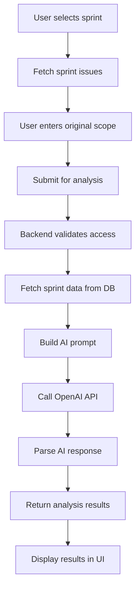

# Scope Creep Detector AI Feature - Comprehensive Analysis

## 📋 Executive Summary

The Scope Creep Detector is an AI-powered feature designed to analyze sprint scope changes and warn users when scope creep occurs. This analysis covers the complete implementation, identifies critical issues, and provides a detailed improvement plan.

## 🔍 Phase 1: Current Implementation Analysis

### 1.1 Architecture Overview

The Scope Creep Detector consists of:

**Frontend Components:**
- `ScopeCreepDetection.jsx` - Main component with form and results display
- `ScopeCreepPage.jsx` - Dedicated page using SprintSelector component  
- `SprintSelector.jsx` - Sprint selection dropdown component

**Backend Services:**
- `aiController.js` - `detectScopeCreep` endpoint handler
- `aiService.js` - AI prompt building and response parsing
- API endpoint: `POST /ai/projects/:projectId/scope-creep`

**Navigation:**
- Accessible via `/ai/scope-creep/:projectId` route
- Listed in AI navigation menu and AI features dashboard

### 1.2 Data Flow Analysis



### 1.3 AI Prompt Engineering

**Current Prompt Structure:**
```
Analyze the following sprint for scope creep:

Original Sprint Goal: ${sprintGoal}

Original Issues (at sprint start):
${originalIssues.map(issue => `- ${issue.title} (${issue.story_points || 0} points)`).join('\n')}

Current Issues (now):
${currentIssues.map(issue => `- ${issue.title} (${issue.story_points || 0} points, Status: ${issue.status})`).join('\n')}

Analyze for scope creep and provide:
1. Scope creep severity (Low/Medium/High)
2. Added work not in original plan
3. Impact on sprint goal
4. Recommendations to address scope creep

Format as JSON:
{
  "severity": "Low|Medium|High",
  "scope_creep_detected": true/false,
  "added_work": [list of new work items],
  "impact_analysis": "text",
  "recommendations": [list of recommendations]
}
```

**Expected Response Format:**
```json
{
  "severity": "Low|Medium|High",
  "scope_creep_detected": true/false,
  "added_work": ["list of new work items"],
  "impact_analysis": "text analysis",
  "recommendations": ["list of recommendations"]
}
```

### 1.4 API Integration Details

**Request Flow:**
1. Frontend calls `aiService.scopeCreepDetection(projectId, formData)`
2. Maps to `POST /ai/projects/:projectId/scope-creep`
3. Controller validates user access and project permissions
4. Fetches sprint data from database
5. Calls AI service with sprint data
6. Returns formatted response

**Response Structure:**
```json
{
  "success": true,
  "data": {
    "scope_analysis": {
      "severity": "Medium",
      "scope_creep_detected": true,
      "added_work": ["New feature X", "Additional bug fixes"],
      "impact_analysis": "Sprint goal may be at risk...",
      "recommendations": ["Remove non-critical items", "Extend sprint"]
    },
    "sprint_info": {
      "id": 1,
      "name": "Sprint 1",
      "goal": "Implement user authentication",
      "status": "Active"
    }
  }
}
```

## 🚨 Phase 2: Critical Issues Identified

### 2.1 Major Implementation Flaws

#### **Issue #1: Missing Historical Data Tracking**
**Problem:** The current implementation uses current issues as both original and current issues.

```javascript
// backend/controllers/aiController.js lines 351-367
// Get original issues (from sprint start) - this would need to be tracked separately
// For now, we'll use current issues as a simplified approach
const sprintData = {
  sprintGoal: sprint.goal,
  originalIssues: currentIssues, // ❌ CRITICAL FLAW
  currentIssues: currentIssues.map(issue => ({
    id: issue.id,
    title: issue.title,
    status: issue.status,
    story_points: issue.story_points
  }))
};
```

**Impact:** Scope creep cannot be detected without historical baseline data.

#### **Issue #2: Missing Sprint Service Method**
**Problem:** `SprintSelector` calls non-existent `getProjectSprints` method.

```javascript
// frontend/src/components/ai/SprintSelector.jsx line 17
const response = await sprintService.getProjectSprints(projectId); // ❌ METHOD DOESN'T EXIST
```

**Impact:** Sprint selection fails, preventing feature usage.

#### **Issue #3: Inconsistent Data Structure**
**Problem:** Two different page implementations expect different data structures.

- `ScopeCreepPage.jsx` expects `originalIssues` and `currentIssues` arrays
- `ScopeCreepDetection.jsx` expects manual scope description input

#### **Issue #4: Response Format Mismatch**
**Problem:** Frontend expects different response format than backend provides.

**Backend returns:**
```json
{
  "scope_analysis": { "severity": "High", ... },
  "sprint_info": { ... }
}
```

**Frontend expects:**
```json
{
  "creepDetected": true,
  "creepPercentage": 25,
  "affectedAreas": [...],
  "recommendations": [...]
}
```

### 2.2 Frontend Logic Issues

#### **Issue #5: Validation Logic Inconsistency**
The validation requires `currentIssues` array but the component allows empty arrays.

```javascript
// frontend/src/services/ai/aiUtils.js lines 75-77
if (!data.currentIssues || !Array.isArray(data.currentIssues) || data.currentIssues.length === 0) {
  errors.currentIssues = 'Current issues list is required'; // ❌ Too strict
}
```

#### **Issue #6: Missing Error Handling**
No proper error handling for AI service failures or quota exceeded scenarios.

### 2.3 Backend Logic Issues

#### **Issue #7: Inadequate Scope Creep Logic**
The AI prompt doesn't provide sufficient context for meaningful scope creep detection:
- No sprint timeline information
- No story point capacity vs. actual comparison
- No velocity or team capacity context
- No historical sprint performance data

#### **Issue #8: Missing Sprint State Tracking**
No database schema to track:
- Original sprint scope at start
- Issue additions/removals during sprint
- Scope change timestamps
- Reason for scope changes

## 🔧 Phase 3: Technical Deep Dive

### 3.1 Scope Creep Detection Logic Analysis

**Current Logic Limitations:**
1. **No Baseline Comparison:** Cannot compare current state to original state
2. **No Quantitative Metrics:** Missing story point calculations, velocity impact
3. **No Timeline Context:** Doesn't consider when changes occurred
4. **No Change Attribution:** Cannot identify who made changes or why

**What Constitutes Scope Creep (Missing Implementation):**
1. **Story Point Increase:** Total story points > original capacity
2. **Issue Addition:** New issues added after sprint start
3. **Scope Expansion:** Issues with larger scope than originally estimated
4. **Goal Deviation:** Work that doesn't align with sprint goal
5. **Timeline Impact:** Changes that affect sprint completion date

### 3.2 AI Model and Prompt Engineering Analysis

**Current Model:** GPT-3.5-turbo (based on environment variable)
**Token Limit:** Default (likely 4096 tokens)
**Temperature:** Not specified (likely default 1.0)

**Prompt Engineering Issues:**
1. **Insufficient Context:** Missing team capacity, velocity, timeline
2. **Poor Structure:** Doesn't guide AI to specific analysis patterns
3. **Vague Instructions:** "Analyze for scope creep" is too general
4. **Missing Examples:** No few-shot examples for better accuracy

### 3.3 Database Schema Gaps

**Missing Tables/Fields for Scope Creep Tracking:**
```sql
-- Sprint baseline tracking
CREATE TABLE sprint_baselines (
  id INT PRIMARY KEY AUTO_INCREMENT,
  sprint_id INT NOT NULL,
  created_at TIMESTAMP DEFAULT CURRENT_TIMESTAMP,
  baseline_story_points INT,
  baseline_issue_count INT,
  baseline_issues JSON, -- Snapshot of issues at sprint start
  FOREIGN KEY (sprint_id) REFERENCES sprints(id)
);

-- Issue change tracking
CREATE TABLE issue_changes (
  id INT PRIMARY KEY AUTO_INCREMENT,
  issue_id INT NOT NULL,
  sprint_id INT,
  change_type ENUM('added', 'removed', 'modified'),
  changed_at TIMESTAMP DEFAULT CURRENT_TIMESTAMP,
  changed_by INT,
  old_values JSON,
  new_values JSON,
  reason TEXT,
  FOREIGN KEY (issue_id) REFERENCES issues(id),
  FOREIGN KEY (sprint_id) REFERENCES sprints(id),
  FOREIGN KEY (changed_by) REFERENCES users(id)
);
```

## 🎯 Phase 4: Comprehensive Improvement Plan

### 4.1 Immediate Fixes (Priority 1)

#### **Fix #1: Implement Missing Sprint Service Method**
```javascript
// Add to sprintService.js
getProjectSprints: async (projectId, params = {}) => {
  return await sprintService.getByProject(projectId, params);
}
```

#### **Fix #2: Fix Response Format Mapping**
Create proper response transformation in aiUtils.js

#### **Fix #3: Implement Sprint Baseline Tracking**
Add database migration and service methods to track sprint baselines

#### **Fix #4: Fix Validation Logic**
Allow empty current issues but provide meaningful feedback

### 4.2 Enhanced Scope Creep Detection Algorithm (Priority 2)

#### **Algorithm Components:**
1. **Quantitative Analysis:**
   - Story point variance: `(current_points - original_points) / original_points * 100`
   - Issue count variance: `(current_count - original_count) / original_count * 100`
   - Velocity impact: Compare against team's historical velocity

2. **Qualitative Analysis:**
   - Goal alignment scoring using AI
   - Change reason categorization
   - Risk assessment based on timeline

3. **Temporal Analysis:**
   - When changes occurred (early vs. late in sprint)
   - Frequency of changes
   - Pattern recognition across sprints

#### **Enhanced AI Prompt:**
```
You are a sprint management expert analyzing scope creep in an Agile sprint.

SPRINT CONTEXT:
- Sprint Goal: ${sprintGoal}
- Original Capacity: ${originalCapacity} story points
- Sprint Duration: ${sprintDuration} days
- Days Remaining: ${daysRemaining}
- Team Velocity (avg): ${teamVelocity} points/sprint

BASELINE (Sprint Start):
- Total Story Points: ${originalPoints}
- Issue Count: ${originalCount}
- Issues: ${originalIssues.map(formatIssue).join('\n')}

CURRENT STATE:
- Total Story Points: ${currentPoints} (${pointsVariance}% change)
- Issue Count: ${currentCount} (${countVariance}% change)
- Issues: ${currentIssues.map(formatIssue).join('\n')}

CHANGES MADE:
${changes.map(formatChange).join('\n')}

ANALYSIS REQUIRED:
1. Calculate scope creep severity (0-100 scale)
2. Identify specific scope creep patterns
3. Assess impact on sprint goal achievement
4. Evaluate timeline risk
5. Provide actionable recommendations

RESPONSE FORMAT:
{
  "scope_creep_score": 0-100,
  "severity": "None|Low|Medium|High|Critical",
  "scope_creep_detected": boolean,
  "analysis": {
    "story_point_impact": "analysis",
    "timeline_impact": "analysis",
    "goal_alignment_impact": "analysis"
  },
  "identified_patterns": [
    {
      "pattern": "pattern_name",
      "description": "description",
      "impact": "Low|Medium|High"
    }
  ],
  "recommendations": [
    {
      "action": "specific_action",
      "priority": "High|Medium|Low",
      "rationale": "why_this_helps"
    }
  ],
  "risk_factors": [
    {
      "risk": "risk_description",
      "probability": "Low|Medium|High",
      "impact": "Low|Medium|High"
    }
  ]
}
```

### 4.3 Database Schema Enhancements

#### **Sprint Baseline Tracking Implementation:**
```sql
-- Migration: Add sprint baseline tracking
ALTER TABLE sprints ADD COLUMN baseline_captured_at TIMESTAMP NULL;
ALTER TABLE sprints ADD COLUMN baseline_story_points INT DEFAULT 0;
ALTER TABLE sprints ADD COLUMN baseline_issue_count INT DEFAULT 0;

-- Create sprint_issue_snapshots table
CREATE TABLE sprint_issue_snapshots (
  id INT PRIMARY KEY AUTO_INCREMENT,
  sprint_id INT NOT NULL,
  snapshot_type ENUM('baseline', 'current') NOT NULL,
  captured_at TIMESTAMP DEFAULT CURRENT_TIMESTAMP,
  total_story_points INT DEFAULT 0,
  total_issues INT DEFAULT 0,
  issues_data JSON,
  FOREIGN KEY (sprint_id) REFERENCES sprints(id),
  INDEX idx_sprint_snapshot (sprint_id, snapshot_type)
);

-- Create issue_audit_log table
CREATE TABLE issue_audit_log (
  id INT PRIMARY KEY AUTO_INCREMENT,
  issue_id INT NOT NULL,
  sprint_id INT,
  action ENUM('added_to_sprint', 'removed_from_sprint', 'story_points_changed', 'status_changed') NOT NULL,
  old_value JSON,
  new_value JSON,
  changed_by INT,
  changed_at TIMESTAMP DEFAULT CURRENT_TIMESTAMP,
  reason TEXT,
  FOREIGN KEY (issue_id) REFERENCES issues(id),
  FOREIGN KEY (sprint_id) REFERENCES sprints(id),
  FOREIGN KEY (changed_by) REFERENCES users(id),
  INDEX idx_sprint_changes (sprint_id, changed_at)
);
```

### 4.4 Enhanced Frontend Implementation

#### **Improved ScopeCreepDetection Component:**
```javascript
const ScopeCreepDetection = ({ projectId, sprintId, className = '' }) => {
  const [analysis, setAnalysis] = useState(null);
  const [loading, setLoading] = useState(false);
  const [selectedSprint, setSelectedSprint] = useState(null);
  const [sprintHistory, setSprintHistory] = useState([]);

  // Enhanced analysis with historical data
  const analyzeScope = async () => {
    const response = await aiService.analyzeScopeCreep(projectId, {
      sprintId: selectedSprint.id,
      includeHistory: true,
      includeVelocityData: true
    });

    setAnalysis(response.data);
  };

  // Real-time scope monitoring
  useEffect(() => {
    if (selectedSprint?.status === 'Active') {
      const interval = setInterval(fetchSprintChanges, 300000); // 5 minutes
      return () => clearInterval(interval);
    }
  }, [selectedSprint]);

  return (
    <div className={`bg-white rounded-lg shadow-lg p-6 ${className}`}>
      {/* Enhanced UI with charts and detailed analysis */}
    </div>
  );
};
```

### 4.5 Advanced Features Implementation

#### **Real-time Scope Monitoring:**
```javascript
// WebSocket integration for real-time updates
const useScopeMonitoring = (sprintId) => {
  useEffect(() => {
    const ws = new WebSocket(`ws://localhost:3001/scope-monitor/${sprintId}`);

    ws.onmessage = (event) => {
      const update = JSON.parse(event.data);
      if (update.type === 'scope_change') {
        // Trigger scope creep analysis
        analyzeScopeCreep(update.data);
      }
    };

    return () => ws.close();
  }, [sprintId]);
};
```

#### **Predictive Scope Creep Detection:**
```javascript
// ML-based prediction using historical patterns
const predictScopeCreep = async (sprintData) => {
  const features = extractFeatures(sprintData);
  const prediction = await aiService.predictScopeCreep(features);
  return prediction;
};
```

### 4.6 Testing Strategy

#### **Unit Tests:**
```javascript
describe('ScopeCreepDetection', () => {
  test('detects scope creep when story points increase', () => {
    const baseline = { storyPoints: 20, issues: 5 };
    const current = { storyPoints: 30, issues: 7 };
    const result = detectScopeCreep(baseline, current);
    expect(result.detected).toBe(true);
    expect(result.severity).toBe('Medium');
  });
});
```

#### **Integration Tests:**
```javascript
describe('Scope Creep API', () => {
  test('returns accurate scope analysis', async () => {
    const response = await request(app)
      .post('/api/ai/projects/1/scope-creep')
      .send({ sprintId: 1 });

    expect(response.status).toBe(200);
    expect(response.body.data.scope_analysis).toBeDefined();
  });
});
```

#### **E2E Tests:**
```javascript
describe('Scope Creep Feature', () => {
  test('user can analyze scope creep for active sprint', async () => {
    await page.goto('/ai/scope-creep/1');
    await page.selectOption('[data-testid=sprint-selector]', '1');
    await page.click('[data-testid=analyze-button]');
    await expect(page.locator('[data-testid=analysis-results]')).toBeVisible();
  });
});
```

## 📊 Success Metrics

### 4.7 Key Performance Indicators

1. **Detection Accuracy:** >85% accuracy in identifying actual scope creep
2. **Response Time:** <3 seconds for analysis completion
3. **User Adoption:** >60% of active projects use the feature monthly
4. **False Positive Rate:** <15% false scope creep alerts
5. **User Satisfaction:** >4.0/5.0 rating for feature usefulness

### 4.8 Monitoring and Analytics

```javascript
// Analytics tracking
const trackScopeCreepAnalysis = (projectId, sprintId, result) => {
  analytics.track('scope_creep_analyzed', {
    project_id: projectId,
    sprint_id: sprintId,
    scope_creep_detected: result.detected,
    severity: result.severity,
    analysis_duration: result.processingTime
  });
};
```

## 🚀 Implementation Timeline

### Phase 1: Critical Fixes (Week 1-2)
- [ ] Fix missing sprint service method
- [ ] Implement proper response format mapping
- [ ] Add basic sprint baseline tracking
- [ ] Fix validation logic

### Phase 2: Enhanced Detection (Week 3-4)
- [ ] Implement enhanced AI prompts
- [ ] Add quantitative scope creep calculations
- [ ] Create comprehensive database schema
- [ ] Build improved frontend components

### Phase 3: Advanced Features (Week 5-6)
- [ ] Real-time scope monitoring
- [ ] Predictive scope creep detection
- [ ] Advanced analytics and reporting
- [ ] Comprehensive testing suite

### Phase 4: Optimization (Week 7-8)
- [ ] Performance optimization
- [ ] User experience improvements
- [ ] Documentation and training materials
- [ ] Production deployment and monitoring

## 📝 Conclusion

The current Scope Creep Detector implementation has significant architectural flaws that prevent it from functioning effectively. The primary issues are:

1. **Missing historical data tracking** - Cannot detect scope creep without baseline
2. **Incomplete service methods** - Sprint selection fails due to missing API methods
3. **Inconsistent data structures** - Frontend and backend expect different formats
4. **Inadequate AI prompting** - Current prompts lack context for meaningful analysis

The proposed improvement plan addresses these issues systematically, providing a robust, accurate, and user-friendly scope creep detection system that will significantly enhance sprint management capabilities.

**Immediate Action Required:**
1. Implement missing `getProjectSprints` method
2. Add sprint baseline tracking to database
3. Fix response format mapping
4. Enhance AI prompts with proper context

This comprehensive analysis provides the foundation for transforming the Scope Creep Detector from a non-functional prototype into a powerful, reliable AI feature that delivers real value to development teams.
