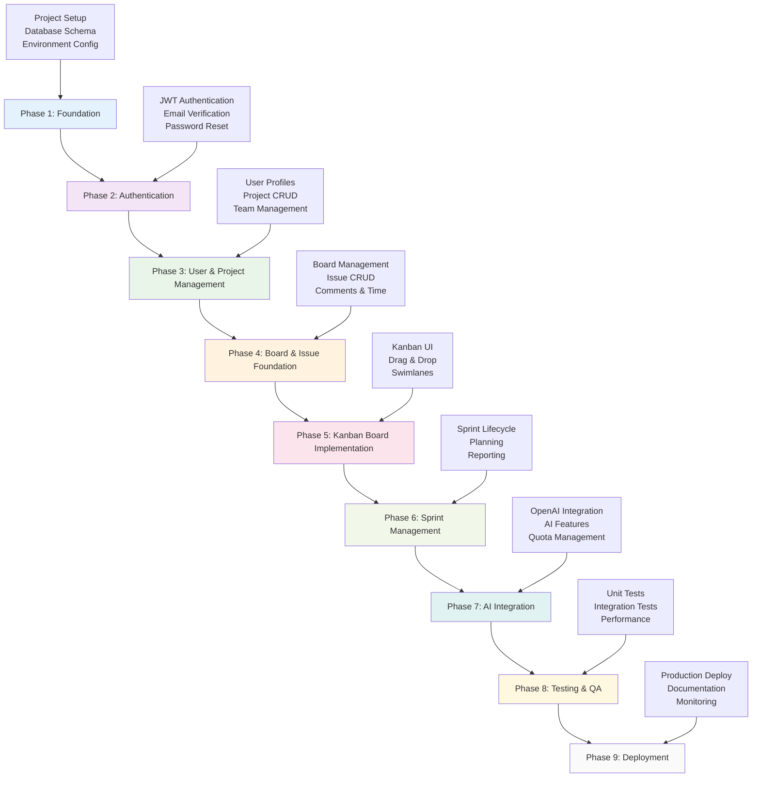
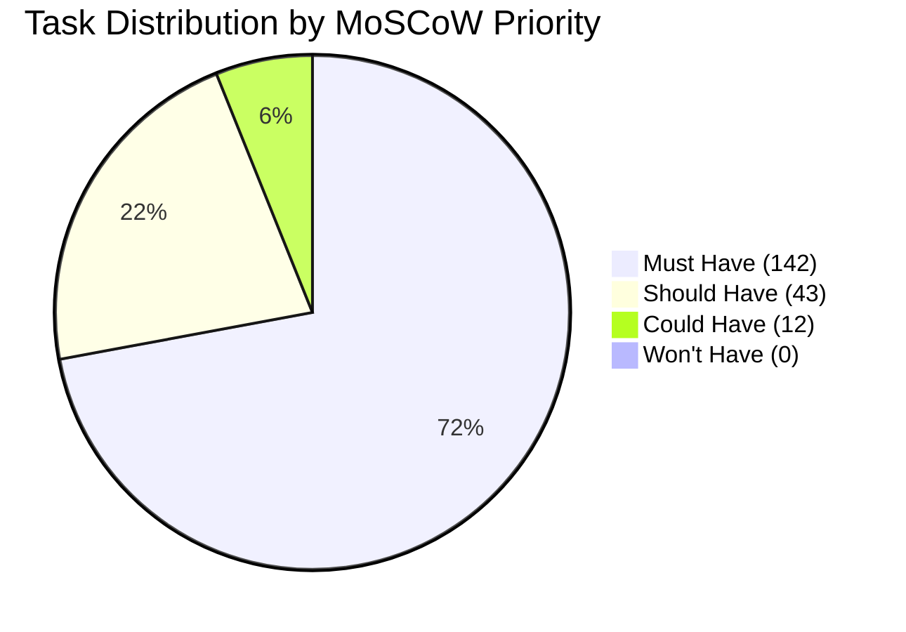
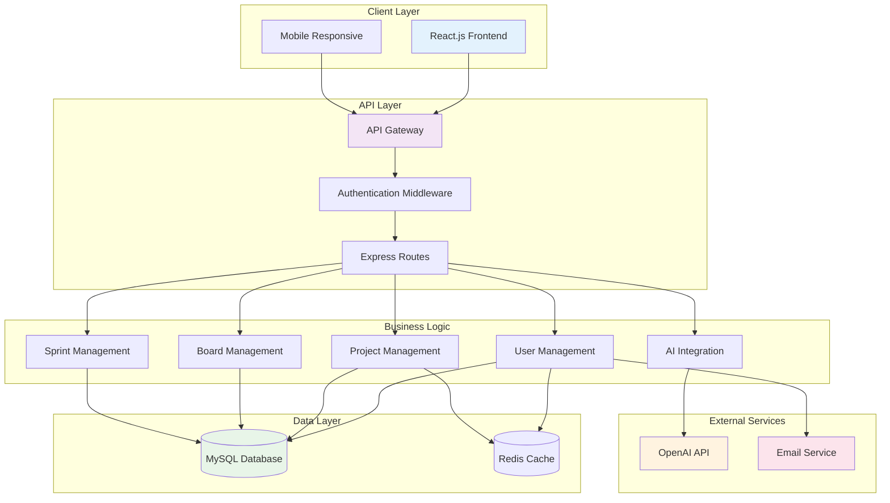
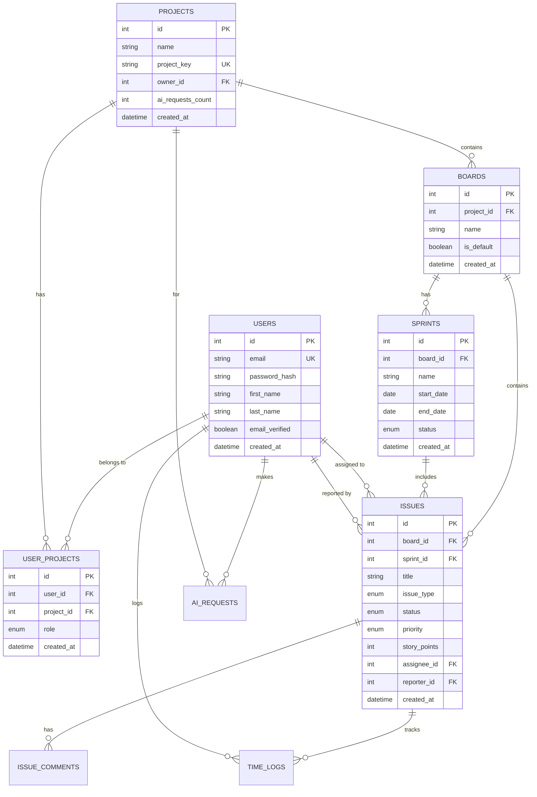
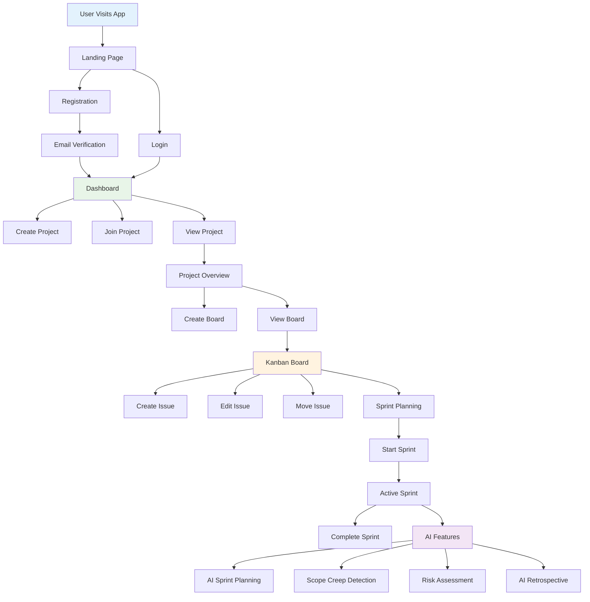
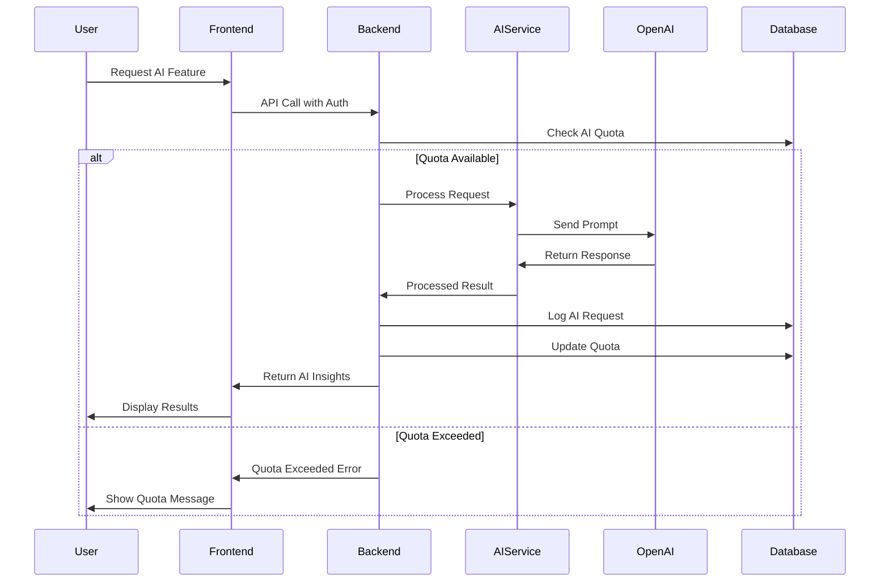
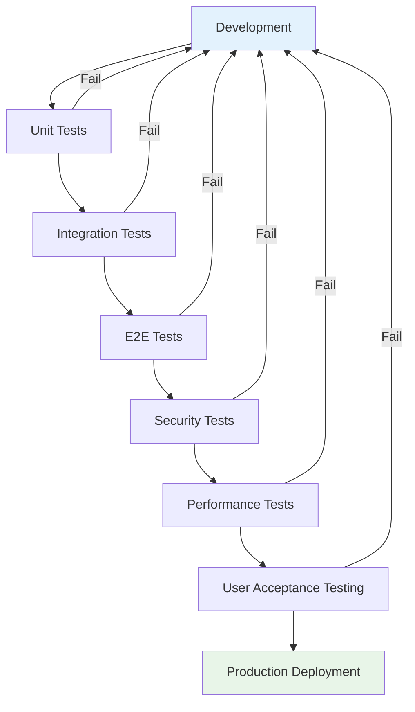
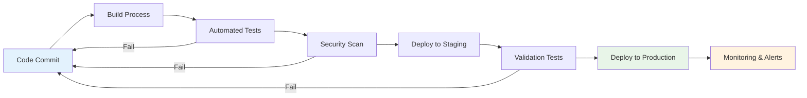
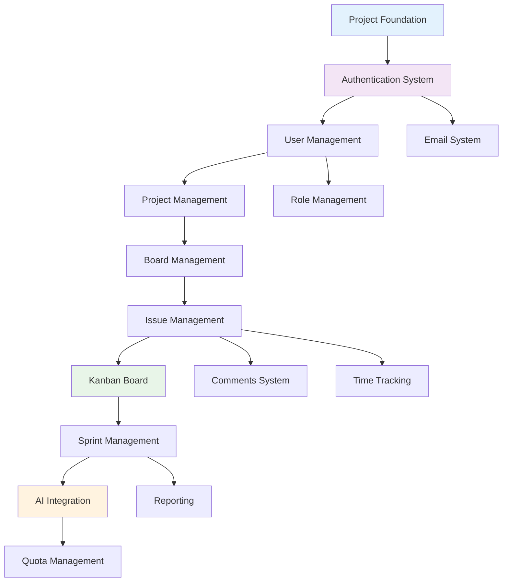

# AI Sprint Management App - Project Flow Diagrams

## Development Phase Flow

## MoSCoW Priority Distribution

## System Architecture

## Database Entity Relationships

## User Journey Flow

## AI Integration Flow

## Testing Strategy Flow

## Deployment Pipeline

## Feature Dependencies

---

*Last Updated: 2024-01-01*
*Generated from AI Sprint Management App PRD*
